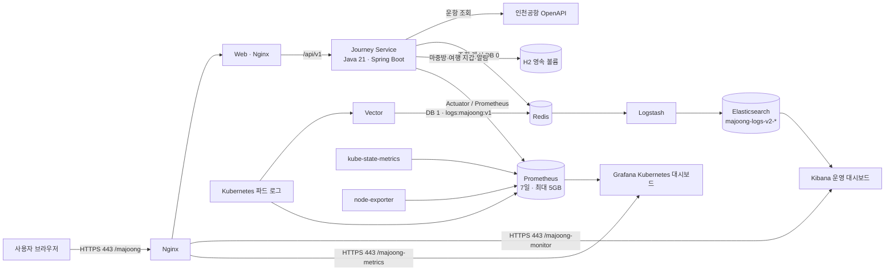

# 마중구름 (Majoong Cloud)

인천국제공항 도착편을 실제 OpenAPI로 조회하고, 가족·지인이 만나는 순간까지 필요한 운항·만남 정보를 한 화면에서 확인하는 웹 서비스입니다. 항공편 번호를 몰라도 날짜와 출발 도시 또는 IATA 공항코드로 찾을 수 있으며, 선택한 항공편으로 읽기 전용 마중 공유방을 만들 수 있습니다.

- 서비스: `https://maru4737.duckdns.org/majoong/`
- 운영 대시보드: `https://maru4737.duckdns.org/majoong-monitor/`
- Kubernetes 대시보드: `https://maru4737.duckdns.org/majoong-metrics/d/majoong-kubernetes/majoong-kubernetes`
- 배포 환경: 단일 노드 Kubernetes, `majoong-dev` 네임스페이스

## 핵심 기능

- 인천공항 상세 운항 OpenAPI 기반의 실시간 도착·출발편 조회
- D-3부터 D+6까지 날짜 선택, 편명·도시·IATA 코드 부분 검색
- OpenAPI 페이지네이션으로 첫 100건만 보이던 문제 해결
- 긴 결과 목록의 50건 단위 무한 스크롤, URL 선택 복원, 모바일 바텀시트 상세
- 항공편별 터미널, 입국 출구, 수하물 수취대, 예정·변경 시각 안내
- 편도·왕복·다구간 여행 지갑 생성·수정·삭제, 구간별 공식편 연결과 캘린더 내보내기
- 날짜·방향·항공편 기준 운항 변경 관심 등록과 앱 내 알림
- 마중방 목록 재진입, 여행자 상태·만남 메모·만남 장소 편집, 완료 처리
- 24시간 만료 읽기 전용 공유 링크와 공식 운항 정보 자동 갱신
- 인천·김포·제주·김해 공항의 공식 지도·편의시설 링크

## 설계와 구현 워크플로

이 프로젝트는 역할을 나누어 진행했습니다.

1. **GPT-6 Astra**가 제품 요구사항, 정보 구조, 실제 공항 데이터의 제약, 보안 경계, 운영 아키텍처와 개선 우선순위를 설계했습니다.
2. **GPT-5.6 Terra**가 설계를 바탕으로 Spring Boot API, 웹 UI, Kubernetes 매니페스트, Redis/Vector/ELK 파이프라인을 구현·배포하고 브라우저 회귀 검증을 수행했습니다.

| 구분 | 사용 도구·스킬 | 역할 |
| --- | --- | --- |
| 제품·시스템 설계 | GPT-6 Astra | API 선택, 데이터 흐름, UX·운영 요구사항 및 위험요소 설계 |
| 구현·배포 | GPT-5.6 Terra | Java/웹 코드, 컨테이너 이미지, Kubernetes·Nginx·ELK 구성 구현 |
| 브라우저 검증 | Browser control skill | 실제 배포 화면의 검색, 항공편 선택, 모바일 흐름, Kibana·Grafana 접근 경계 확인 |
| 캐릭터·시각 자산 | Image generation skill | 서비스의 구름 조종사 캐릭터 등 화면용 비트맵 자산 제작 |
| 코드·운영 도구 | Maven, Docker, containerd, kubectl, Nginx, Git | 테스트, 이미지 빌드·적재, 배포, 443 프록시, 버전 관리 |

## 아키텍처



### 애플리케이션 계층

- **Web**: 정적 HTML/CSS/JavaScript 기반의 반응형 SPA입니다. 실제 항공편 검색, 여행 지갑, 마중방 재진입, 공유 화면, 운항 변경 알림을 명시적 URL 경로로 제공합니다.
- **Journey Service**: Java 21, Spring Boot 3, Spring JDBC, Spring Data Redis, H2를 사용합니다. OpenAPI 결과를 정규화하고, 조회 결과를 Redis DB 0에 15분간 저장합니다.
- **공식 데이터 소스**: 인천국제공항공사 `항공기 운항 현황 상세 조회` API의 도착·출발 엔드포인트를 사용합니다. 일별 전체 결과를 최대 20페이지까지 수집한 뒤 검색합니다.
- **영속 데이터**: 마중방, 공유 토큰, 여행 지갑, 관심 항공편과 알림은 H2 파일 DB와 Kubernetes 호스트 볼륨에 보존합니다. 여행 지갑 수정은 리비전 기반 충돌 방지를 사용하고 삭제는 소프트 삭제로 처리합니다.

### 관측성 계층

- **Vector**: `majoong-dev` 네임스페이스의 Kubernetes 컨테이너 로그를 구조화합니다.
- **Redis DB 1**: Vector 로그 버퍼입니다. 키는 `logs:majoong:v1`이며 애플리케이션 조회 캐시(DB 0)와 분리되어 있습니다.
- **Logstash**: Redis 리스트를 FIFO로 소비해 Elasticsearch로 적재합니다. 작은 배치 단위로 처리해 누적 로그 재처리 시에도 메모리 사용량을 제어합니다.
- **Elasticsearch**: `majoong-logs-v2-*` 인덱스에 고정 필드 매핑으로 저장합니다. 이전 인덱스와의 필드 타입 충돌을 분리했으며 ILM 정책으로 7일 후 삭제합니다.
- **Kibana**: 전체 로그, 경고·오류, 활성 서비스, 웹 요청, 서비스별 추이, 파드별 로그량, 최근 오류를 최근 30분 기준으로 제공합니다.
- **Prometheus**: Kubernetes API, kubelet/cAdvisor, kube-state-metrics, node-exporter와 Journey Service의 Micrometer 지표를 30초마다 수집해 7일 또는 최대 5GB까지 보관합니다.
- **Grafana**: 노드·파드·디플로이먼트 상태, CPU·메모리·디스크, 컨테이너 자원 사용량, 재시작, 수집 실패, 항공 API 호출·실패·캐시 적중과 여행 저장 횟수를 한 화면에 표시합니다.
  Nginx Basic 인증 사용자를 Auth Proxy로 조직 관리자에 연결하므로 별도 Grafana 로그인 없이 대시보드 임포트·편집이 가능하며, 로고나 홈 이동 후에도 권한이 유지됩니다.

## 서버 구성

| 구성요소 | 기술/버전 | 역할 |
| --- | --- | --- |
| 런타임 | Kubernetes | 서비스·데이터·관측성 워크로드 오케스트레이션 |
| 엣지 | Nginx + TLS 443 | `/majoong/`, `/majoong-monitor/`, `/majoong-metrics/` 라우팅 및 운영 화면 Basic 인증 |
| 백엔드 | Java 21, Spring Boot 3.5 | API, OpenAPI 연동, 공유·여정 도메인 |
| 프런트엔드 | Nginx 1.27, Vanilla JS | 사용자 화면 제공 |
| 캐시/버퍼 | Redis 7.4 | 조회 캐시 DB 0, Vector 로그 큐 DB 1 |
| 로그 수집 | Vector 0.58 | Kubernetes 로그 수집·정규화 |
| 로그 처리 | Logstash 9.5 | Redis → Elasticsearch 적재 |
| 로그 검색/대시보드 | Elasticsearch/Kibana 9.5 | 로그 보관·운영 시각화 |
| 메트릭 수집 | Prometheus 3.14, kube-state-metrics 2.20, node-exporter 1.12 | Kubernetes·노드·컨테이너 상태 수집 |
| 메트릭 대시보드 | Grafana 13.2 | 클러스터 상태·자원·재시작·경고 시각화 |

현재 배포 이미지 태그는 `majoong/journey-service:0.5.0`, `majoong/web:0.5.1`입니다.

## 배포 구성과 운영

주요 매니페스트는 다음 위치에 있습니다.

- `deploy/k8s/majoong.yaml`: Redis, Journey Service, Web, Vector, 로그 정리 CronJob
- `deploy/k8s/elk.yaml`: Elasticsearch, Logstash, Kibana, 7일 ILM, Kibana 부트스트랩
- `deploy/k8s/metrics.yaml`: Prometheus, Grafana, kube-state-metrics, node-exporter와 Kubernetes 운영 대시보드
- `deploy/k8s/majoong-proxy.conf`: Nginx 443 경로 프록시와 운영 화면 인증 경계
- `deploy/kibana/majoong-operations-dashboard.json`: Kibana 운영 대시보드 정의

일반적인 반영 순서입니다.

```bash
mvn test
kubectl apply -f deploy/k8s/majoong.yaml
make monitoring
make metrics
```

Grafana 템플릿은 `/majoong-metrics/dashboard/import`에서 JSON 파일 또는 Grafana.com 대시보드 ID로 가져올 수 있습니다. 외부 요청은 Nginx Basic 인증을 통과해야 하며, Nginx가 인증 사용자 헤더를 덮어써서 Grafana에 전달합니다.

컨테이너 이미지를 새 태그로 빌드한 경우, 로컬 Kubernetes 런타임(containerd)에 이미지를 적재한 뒤 매니페스트의 이미지 태그를 갱신하고 롤아웃 상태를 확인합니다.

```bash
kubectl -n majoong-dev rollout status deployment/journey-service
kubectl -n majoong-dev rollout status deployment/web
kubectl -n majoong-dev rollout status deployment/logstash
```

## 보안과 데이터 처리 원칙

- 공항 OpenAPI 키, Redis 비밀번호, Kibana 암호화 키, 운영 화면 Basic 인증 정보는 Kubernetes Secret으로만 관리합니다. Git, 이미지, 애플리케이션 로그에 저장하지 않습니다.
- 공유 링크에는 256비트 무작위 토큰의 해시만 보관하며, 기본 24시간 후 만료됩니다. 마중 완료 시 연결된 공유 링크를 해지합니다.
- 공유 화면의 운항 정보는 **마중방 생성 시점의 스냅샷**입니다. 여행자 상태와 공식 운항 정보의 갱신 시점을 혼동하지 않도록 화면에 명시합니다.
- Redis DB 0의 운항 조회 결과는 15분 캐시이며, API 원본의 호출 제한을 고려합니다.

## 검증

최근 배포에서는 다음을 확인했습니다.

- Maven 컴파일·테스트 통과
- 실제 `HKG` 출발지 검색으로 49건의 인천 도착편 반환
- 실제 `CX426` 항공편 선택과 터미널·출구·수하물 정보 표시
- 검색 URL·선택 상태 복원, 필터 초기화, 왕복 입력 보존과 모바일 상세 확인
- 여행 지갑 생성·조회·수정·충돌·삭제 API 회귀 테스트 통과
- Kibana 대시보드의 과거 `verification_exception` 필드 매핑 오류 제거
- Journey Service Prometheus 수집 대상 `UP`, Grafana Kubernetes·제품 지표 패널 응답 확인

API 개발 키는 호출량 제한이 있으므로 운영 환경에서는 캐시 적중률, 오류율, OpenAPI 일일 사용량을 함께 관찰해야 합니다.
